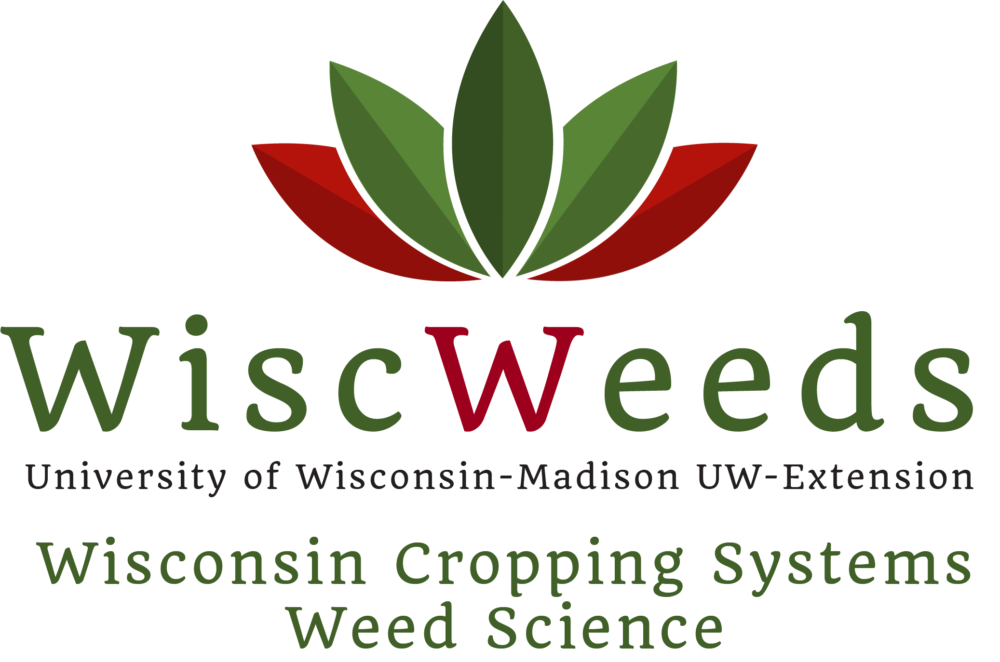

## Header row {data-height=3.5}

###

<table style="width:100%">
<tr>
  <td><center><h3>
  **Survey of Nebraska and Wisconsin soybean producers on dicamba use during 2017 and 2018**
  </h3></center></td>
  <td rowspan="1">
  </img>
  </td>
</tr>
<tr><td><center>
  **Maxwel C. Oliveira^1^, Christopher Proctor^2^, Paul Mitchell^1^, Amit Jhala^2^ and Rodrigo Werle^1^**
  </center></td>
</tr>
</table> 

<hr>

<tr><td><center>
^1^ University of Wisconsin-Madison and ^2^ University of Nebraska-Lincoln
  </center></td>

<tr><td><center>
<font size="0.2"> ^1^Corresponding author's E-mail: max.oliveira@wisc.edu</font> 

  </center></td>


## Body row {data-height=87.5 .small}

### 

#### **INTRODUCTION**

* Due to off-target dicamba movement incidents during the 2017 and 2018 growing seasons, adoption of the Xtend technology (dicamba and glyphosate-tolerant soybeans) has become a controversial topic in the United States. 

* The **OBJECTIVE** of the survey was to understand Nebraska and Wisconsin stakeholders’ adoption and opinion related to the Xtend technology.

#### **MATERIAL AND METHODS**

##### **Survey**

* From August through September of 2018, a survey containing 22 questions related to soybean, dicamba and weed management was conducted in Nebraska and Wisconsin (Figure 1).

```{r, echo=FALSE, fig.cap="Figure 1. Survey questions of soybean production and dicamba use in Nebraska and Wisconsin.", out.width = '83%', fig.align="center", fig.retina = 2, fig.pos='h'}
knitr::include_graphics("resources/survey.png", dpi=600)
```

##### **Data analysis**

* Survey respondents as agronomist, co-op, university and industry representatives were grouped into **Decision influencer**.

* Data are presented as a % of responses from **decision influencer** and **farmer** of Nebraska and Wisconsin.

* Q4 is presented as the share of Xtend hectares compared to the total of soybean hactares reported in Q3; Q5 is the share of PRE-applied dicamba hectares compared to the total of Xtend hactares reported in Q4; Q6 is the share of POST-applied dicamba hectares compared to the total of Xtend hactares reported in Q4. 

* Data analysis was conducted in *R* statistical software using functions %>%, select, summarise, group, filter and mutate of **tidyverse** (ggplot, tidyr, dplyr) package. 

* Method loess (local polynomial) regression fitting was performed in Q4, Q5, and Q6 (Figures 4, 5, and 6).


### 

#### **RESULTS**

```{r, echo=FALSE, fig.cap="Figure 2. Map of survey respondents of Nebraska and Wisconsin.", out.width = '74%', fig.align="center", fig.retina = 2, fig.pos='h'}
knitr::include_graphics("resources/map.png", dpi=600)
```


```{r, echo=FALSE, fig.cap="Figure 3. Primary role of survey respontens from Nebraska (n=316) and Wisconsin (n=149).", out.width = '78%', fig.align="center", fig.retina = 2, fig.pos='h'}
knitr::include_graphics("resources/Role.png", dpi=600)
```


```{r, echo=FALSE, fig.cap="Figure 4. Share of Xtend soybean hectares planted in Nebraska and Wisconsin.", out.width = '54%', fig.align="center", fig.retina = 2, fig.pos='h'}
knitr::include_graphics("resources/ShareXtend.png", dpi=600)
```


```{r, echo=FALSE, fig.cap="Figure 5. Share of PRE-applied dicamba in Xtend soybean hectares in Nebraska and Wisconsin.", out.width = '54%', fig.align="center", fig.retina = 2, fig.pos='h'}
knitr::include_graphics("resources/SharePRE.png", dpi=600)
```


```{r, echo=FALSE, fig.cap="Figure 6. Share of POST-applied dicamba in Xtend soybean hectares in Nebraska and Wisconsin.", out.width = '54%', fig.align="center", fig.retina = 2, fig.pos='h'}
knitr::include_graphics("resources/SharePOST.png", dpi=600)
```


### 

#### **RESULTS**

```{r, echo=FALSE, fig.cap="Figure 7. General farm management.", out.width = '84%', fig.align="center", fig.retina = 2, fig.pos='h'}
knitr::include_graphics("resources/Section1.png", dpi=600)
```

```{r, echo=FALSE, fig.cap="Figure 8. Dicamba formulation adopted in Nebraska (n=149) and Wiscosnin (n=44).", out.width = '84%', fig.align="center", fig.retina = 2, fig.pos='h'}
knitr::include_graphics("resources/Herbicide.png", dpi=600)
```


##### **Dicamba application POST-emergence in Xtend soybean**


```{r, echo=FALSE, fig.cap="Figure 9. Dicamba application POST-emergence in Xtend soybeans.", out.width = '84%', fig.align="center", fig.retina = 2, fig.pos='h'}
knitr::include_graphics("resources/Section2.png", dpi=600)
```


##### **Non-Xtend soybean hectares**


```{r, echo=FALSE, fig.cap="Figure 10. Impact on non-Xtend soybeans hectares.", out.width = '84%', fig.align="center", fig.retina = 2, fig.pos='h'}
knitr::include_graphics("resources/Section3.png", dpi=600)
```


```{r, echo=FALSE, fig.cap="Figure 11. Main causes for dicamba injury according to survey respondents to non-Xtend soybeans", out.width = '84%', fig.align="center", fig.retina = 2, fig.pos='h'}
knitr::include_graphics("resources/Reason.png", dpi=600)
```


## Footer row {data-height=9} 

### {data-width=20 .small}

#### **AKNOWLEDGEMENTS**

* We would like to thank Lisa Jasa and Sarah Striegel for their assistance, and the survey respondents for their time and valuable feedback. 

```{r, echo=FALSE, out.width = '90%', fig.align="center", fig.retina = 2, fig.pos='h'}
knitr::include_graphics("resources/logo2.png", dpi=600)
```

### {data-width=80 .small}

#### **CONCLUSIONS**

* Faster adoption of the technology in Nebraska is likely due to bigger challenges faced with the widespread presence of herbicide-resistant weeds when compared to Wisconsin.

* In general, Nebraska and Wisconsin growers tended to be more conservative in their answers than decision influencers. 

* These survey responses will aid growers and decision influencers understand current and future adoption of the Xtend technology in the upper Midwest. 

* Further surveys regarding soybean production and dicamba use englobing additional states are necessary to better understand and document stakeholders adoption and opinion related to the Xtend technology.


